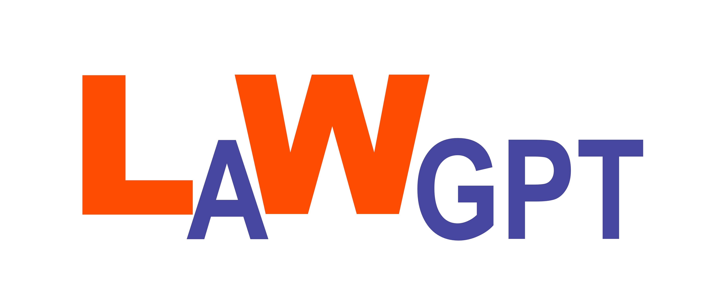

# LaWGPT：基于中文法律知识的大语言模型

<p align="center">
  <a href="./assets/logo/lawgpt2.jpeg">
    
  </a>
</p>

<p align="center">
    <a href=""></a>
    <a href=""></a>
    <a href="https://www.lamda.nju.edu.cn/"></a>
    
</p>

LaWGPT 是一系列中文法律知识增强的开源大语言模型。

该系列模型在 Chinese-LLaMA 的基础上扩充了法律领域词表，并使用大规模中文法律文书、中文法典进行预训练，增强了模型在法律领域的基础语义理解能力。在此基础上，构造多种法律领域对话问答数据集进行指令精调，提升了模型对法律内容的理解和执行能力。

详细内容请参考技术报告。

---

本项目持续开展，后续会相继开源法律领域对话问答数据集及 LaWGPT-13B 的模型。


## 更新

- 💦 2023/04/25：公开发布 LawGPT-7B alpha1.0（内测版）供初步测试使用
  - 基于 Chinese-LLaMA 使用 50w 中文裁判文书数据二次预训练

## 快速开始

**1. 准备代码，创建环境**

```bash
git clone git@github.com:pengxiao-song/LaWGPT.git
cd LawGPT
conda env create -f environment.yml
conda activate lawgpt
```
**2. 下载模型权重**

**3. 启动示例**

## 项目结构


## 数据构建

## 模型训练

中文法律基座模型 LawGPT 的训练过程分为三个阶段：

1.  第一阶段：扩充法律领域词表，在大规模法律文书及法典数据上预训练 Chinese-LLaMA
2.  第二阶段：构造法律领域对话问答数据集，在预训练模型基础上指令精调

### 计算资源

8 张 Tesla V100-SXM2-32GB

### 训练细节


## 模型评估

评估工作正有序开展，敬请期待。

## 局限性

由于计算资源、数据规模等因素限制，当前阶段 LawGPT 存在诸多局限性：

1. 数据资源有限、模型容量较小，导致其相对较弱的模型记忆和语言能力。因此，在面对事实性知识任务时，可能会生成不正确的结果。
2. 该系列模型只进行了初步的人类意图对齐。因此，可能产生不可预测的有害内容以及不符合人类偏好和价值观的内容。
3. 自我认知能力存在问题，中文理解能力有待增强。

请诸君在使用前了解上述问题，以免造成误解和不必要的麻烦。

## 协作者

本项目由[南京大学机器学习与数据挖掘研究所（LAMDA）](https://www.lamda.nju.edu.cn/CH.MainPage.ashx)支持。

如下各位合作开展（按字母序排列）：[金苡萱](https://www.lamda.nju.edu.cn/jinyx/)、[宋鹏霄](https://www.lamda.nju.edu.cn/songpx/)、[杨骁文](https://github.com/njuyxw)，由[郭兰哲](https://www.lamda.nju.edu.cn/guolz/)老师、[李宇峰](https://cs.nju.edu.cn/liyf/index.htm)老师指导。

## 免责声明

请各位严格遵守如下约定：

1. 本项目任何资源**仅供学术研究使用，严禁任何商业用途**。
2. 模型输出受多种不确定性因素影响，本项目当前无法保证其准确性，**严禁用于真实法律场景**。
3. 本项目不承担任何法律责任，亦不对因使用相关资源和输出结果而可能产生的任何损失承担责任。

## 问题反馈

如有问题，请于 GitHub Issue 中提交。请礼貌讨论，构建和谐交流环境。

> **协作者科研之余全力推进项目进展，由于人力有限难以实时反馈，给诸君带来不便，敬请谅解！**

## 致谢

本项目基于部分开源项目及公开数据集展开，在此对相关项目和研究开发人员表示诚挚的感谢：

- Chinese-LLaMA-Alpaca: https://github.com/ymcui/Chinese-LLaMA-Alpaca
- LLaMA: https://github.com/facebookresearch/llama
- Alpaca: https://github.com/tatsu-lab/stanford_alpaca
- alpaca-lora: https://github.com/tloen/alpaca-lora
- ChatGLM-6B: https://github.com/THUDM/ChatGLM-6B


## 引用

如果您觉得我们的工作对您有所帮助，请考虑引用如下内容
