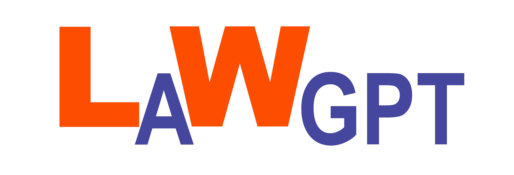
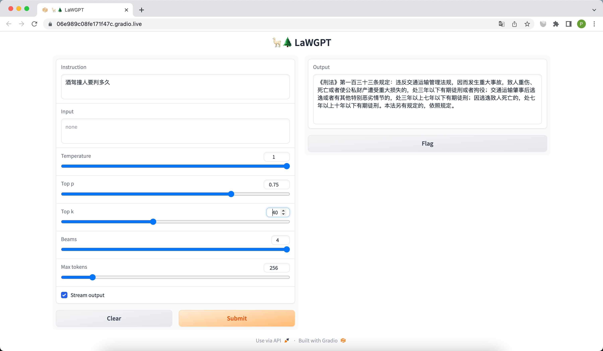
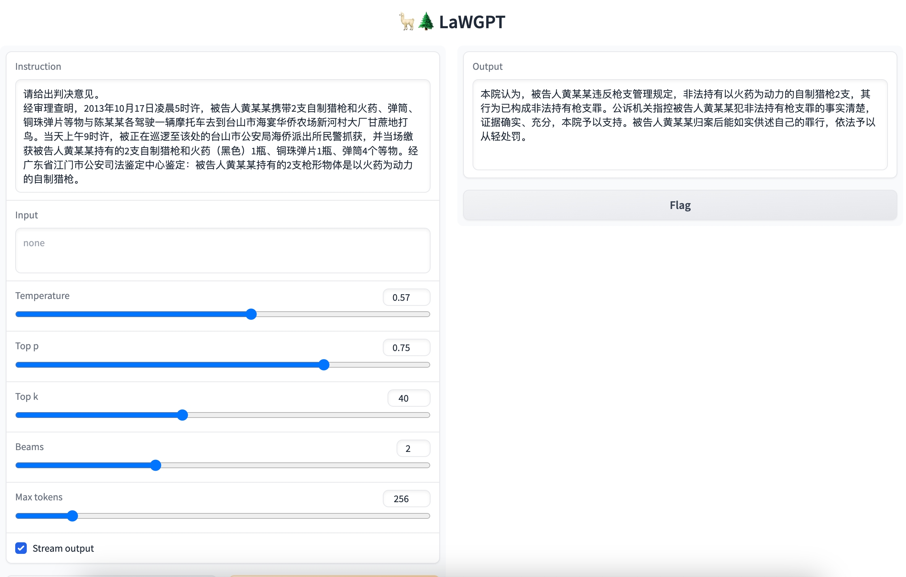
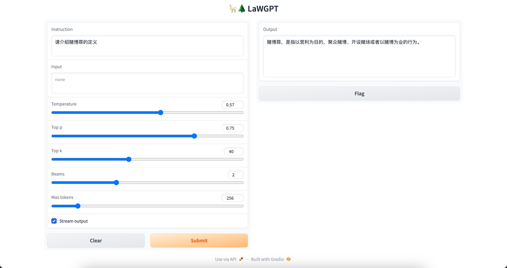
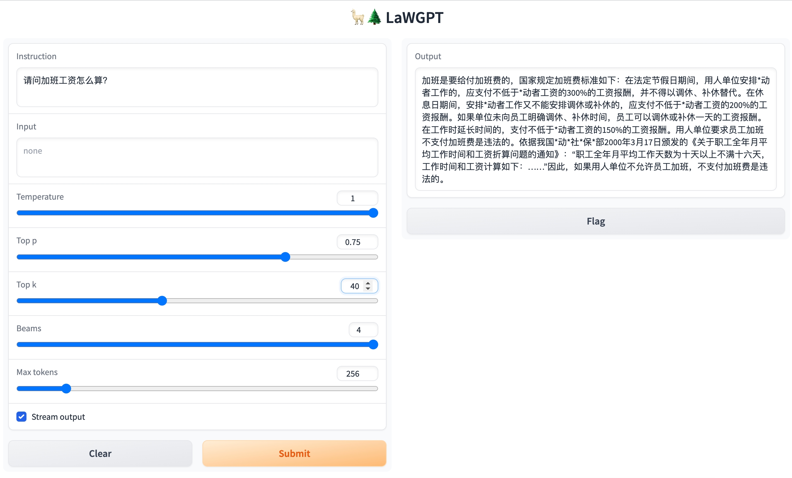
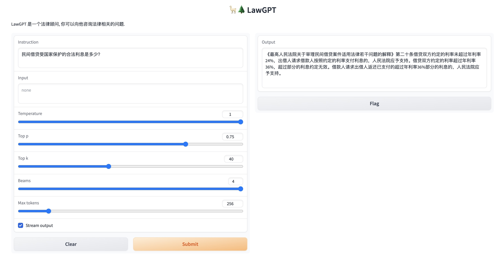
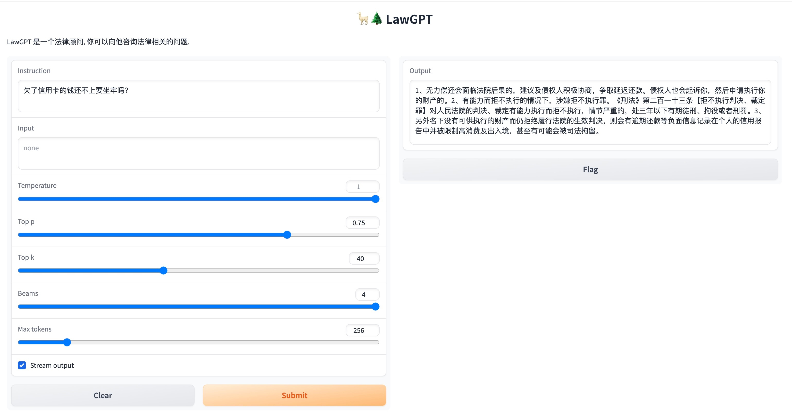

# LaWGPT：基于中文法律知识的大语言模型

<p align="center">
  <a href="assets/logo/lawgpt.jpeg">
    
  </a>
</p>

<p align="center">
    <a href="https://github.com/pengxiao-song/LaWGPT/wiki"></a>
    <a href=""></a>
    <a href=""></a>
    <!-- <a href="https://www.lamda.nju.edu.cn/"></a> -->
</p>

LaWGPT 是一系列基于中文法律知识的开源大语言模型。

该系列模型在通用中文基座模型（如 Chinese-LLaMA、ChatGLM 等）的基础上扩充法律领域专有词表、**大规模中文法律语料预训练**，增强了大模型在法律领域的基础语义理解能力。在此基础上，**构造法律领域对话问答数据集、中国司法考试数据集进行指令精调**，提升了模型对法律内容的理解和执行能力。

详细内容请参考[技术报告]()。

---

本项目持续开展，法律领域数据集及系列模型后续相继开源，敬请关注。

## 更新

- 🪴 2023/05/15：发布 [中文法律数据源汇总（Awesome Chinese Legal Resources）](https://github.com/pengxiao-song/awesome-chinese-legal-resources) 和 [法律领域词表](https://github.com/pengxiao-song/LaWGPT/blob/main/resources/legal_vocab.txt)

- 🌟 2023/05/13：公开发布
  <a href=""></a> 
  <a href=""></a>
  
  - **Legal-Base-7B**：法律基座模型，使用 50w 中文裁判文书数据二次预训练
  
  - **LaWGPT-7B-beta1.0**：法律对话模型，构造 30w 高质量法律问答数据集基于 Legal-Base-7B 指令精调
  
- 🌟 2023/04/12：内部测试
  <a href=""></a>
  - **LaWGPT-7B-alpha**：在 Chinese-LLaMA-7B 的基础上直接构造 30w 法律问答数据集指令精调

## 快速开始

1. 准备代码，创建环境

   ```bash
   # clone 代码
   git clone git@github.com:pengxiao-song/LaWGPT.git
   cd LaWGPT

   # 切换到 dev 分支
   checkout dev

   # 创建环境
   conda create -n lawgpt python=3.10 -y
   conda activate lawgpt
   pip install -r requirements.txt

   # 执行ui脚本(脚本会下载预训练模型,预计占用15GB)
   bash ./scripts/webui.sh
   ```

2. 打开浏览器,访问 http://127.0.0.1:7860/  .在Instruction框输入法律问题,点击"Submit"按钮, 等待模型生成答案
   <p align="center">
      
   </p>

3. 如果您想使用自己的数据进行finetune，请查看脚本`scripts/finetune.sh`：
   ```bash
   # 设置好对应参数后运行脚本
   bash ./scripts/finetune.sh
   ``` 


2. 合并模型权重（可选）
   
   **如果您想使用 LaWGPT-7B-alpha 模型，可跳过改步，直接进入步骤3.**

   如果您想使用 LaWGPT-7B-beta1.0 模型：

   由于 [LLaMA](https://github.com/facebookresearch/llama) 和 [Chinese-LLaMA](https://github.com/ymcui/Chinese-LLaMA-Alpaca) 均未开源模型权重。根据相应开源许可，**本项目只能发布 LoRA 权重**，无法发布完整的模型权重，请各位谅解。
   
   本项目给出[合并方式](https://github.com/pengxiao-song/LaWGPT/wiki/%E6%A8%A1%E5%9E%8B%E5%90%88%E5%B9%B6)，请各位获取原版权重后自行重构模型。


## 项目结构

```bash
LaWGPT
├── assets # 项目静态资源
├── data   # 语料及精调数据
├── tools  # 数据清洗等工具
├── README.md
├── requirements.txt
└── src    # 源码
    ├── finetune.py
    ├── generate.py
    ├── models  # 基座模型及 Lora 权重
    │   ├── base_models
    │   └── lora_weights
    ├── outputs
    ├── scripts # 脚本文件
    │   ├── finetune.sh # 指令微调
    │   └── generate.sh # 服务创建
    ├── templates
    └── utils
```


## 数据构建

本项目基于中文裁判文书网公开法律文书数据、司法考试数据等数据集展开，详情参考[中文法律数据汇总]()

1. 初级数据生成：根据 [Stanford_alpaca](https://github.com/tatsu-lab/stanford_alpaca#data-generation-process) 和 [self-instruct](https://github.com/yizhongw/self-instruct) 方式生成对话问答数据
2. 知识引导的数据生成：通过 Knowledge-based Self-Instruct 方式基于中文法律结构化知识生成数据。
3. 引入 ChatGPT 清洗数据，辅助构造高质量数据集。

## 模型训练

LawGPT 系列模型的训练过程分为两个阶段：

1.  第一阶段：扩充法律领域词表，在大规模法律文书及法典数据上预训练 Chinese-LLaMA
2.  第二阶段：构造法律领域对话问答数据集，在预训练模型基础上指令精调

### 二次训练流程

1. 参考 `src/data/example_instruction_train.json` 构造二次训练数据集
2. 运行 `src/scripts/train_lora.sh` 

### 指令精调步骤

1. 参考 `src/data/example_instruction_tune.json` 构造指令微调数据集
2. 运行 `src/scripts/finetune.sh` 

### 计算资源

8 张 Tesla V100-SXM2-32GB ：二次训练阶段耗时约 24h / epoch，微调阶段耗时约 12h / epoch

## 模型评估

### 输出示例

<details><summary>问题：请给出判决意见。</summary>



</details>

<details><summary>问题：请介绍赌博罪的定义。</summary>



</details>

<details><summary>问题：请问加班工资怎么算？</summary>



</details>

<details><summary>问题：民间借贷受国家保护的合法利息是多少?</summary>



</details>

<details><summary>问题：欠了信用卡的钱还不上要坐牢吗？</summary>



</details>

<details><summary>问题：你能否写一段抢劫罪罪名的案情描述？</summary>


</details>


### 局限性

由于计算资源、数据规模等因素限制，当前阶段 LawGPT 存在诸多局限性：

1. 数据资源有限、模型容量较小，导致其相对较弱的模型记忆和语言能力。因此，在面对事实性知识任务时，可能会生成不正确的结果。
2. 该系列模型只进行了初步的人类意图对齐。因此，可能产生不可预测的有害内容以及不符合人类偏好和价值观的内容。
3. 自我认知能力存在问题，中文理解能力有待增强。

请诸君在使用前了解上述问题，以免造成误解和不必要的麻烦。


## 协作者

如下各位合作开展（按字母序排列）：[@cainiao](https://github.com/herobrine19)、[@njuyxw](https://github.com/njuyxw)、[@pengxiao-song](https://github.com/pengxiao-song)


## 免责声明

请各位严格遵守如下约定：

1. 本项目任何资源**仅供学术研究使用，严禁任何商业用途**。
2. 模型输出受多种不确定性因素影响，本项目当前无法保证其准确性，**严禁用于真实法律场景**。
3. 本项目不承担任何法律责任，亦不对因使用相关资源和输出结果而可能产生的任何损失承担责任。


## 问题反馈

如有问题，请在 GitHub Issue 中提交。

- 提交问题之前，建议查阅 FAQ 及以往的 issue 看是否能解决您的问题。
- 请礼貌讨论，构建和谐社区。

协作者科研之余推进项目进展，由于人力有限难以实时反馈，给诸君带来不便，敬请谅解！


## 致谢

本项目基于如下开源项目展开，在此对相关项目和开发人员表示诚挚的感谢：

- Chinese-LLaMA-Alpaca: https://github.com/ymcui/Chinese-LLaMA-Alpaca
- LLaMA: https://github.com/facebookresearch/llama
- Alpaca: https://github.com/tatsu-lab/stanford_alpaca
- alpaca-lora: https://github.com/tloen/alpaca-lora
- ChatGLM-6B: https://github.com/THUDM/ChatGLM-6B

此外，本项目基于开放数据资源，详见 [Awesome Chinese Legal Resources](https://github.com/pengxiao-song/awesome-chinese-legal-resources)，一并表示感谢。


## 引用

如果您觉得我们的工作对您有所帮助，请考虑引用该项目